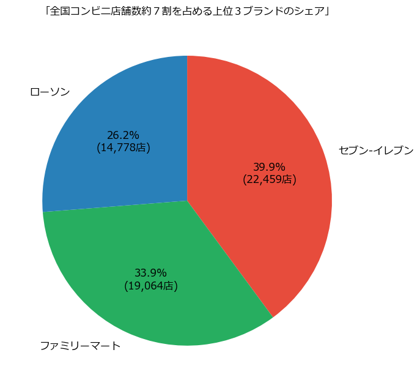
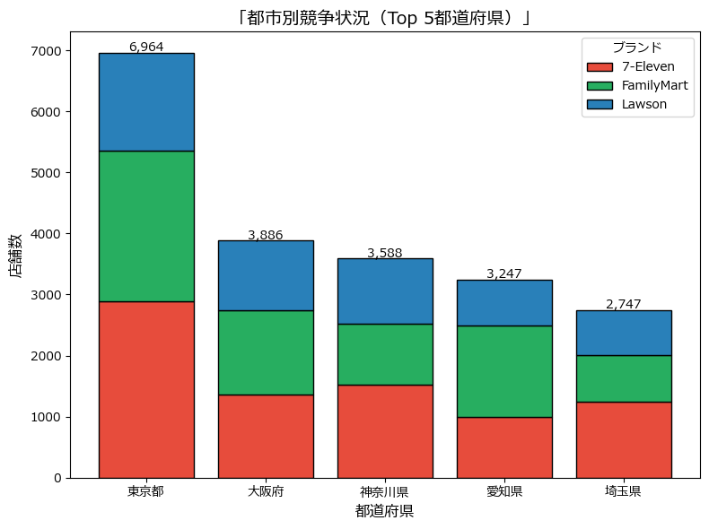
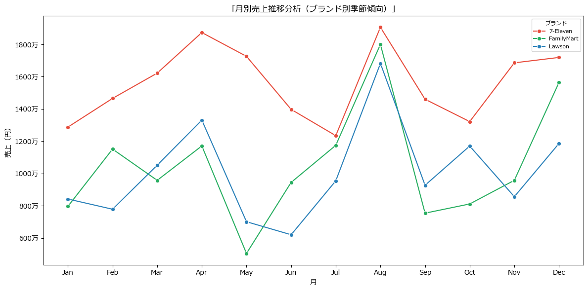
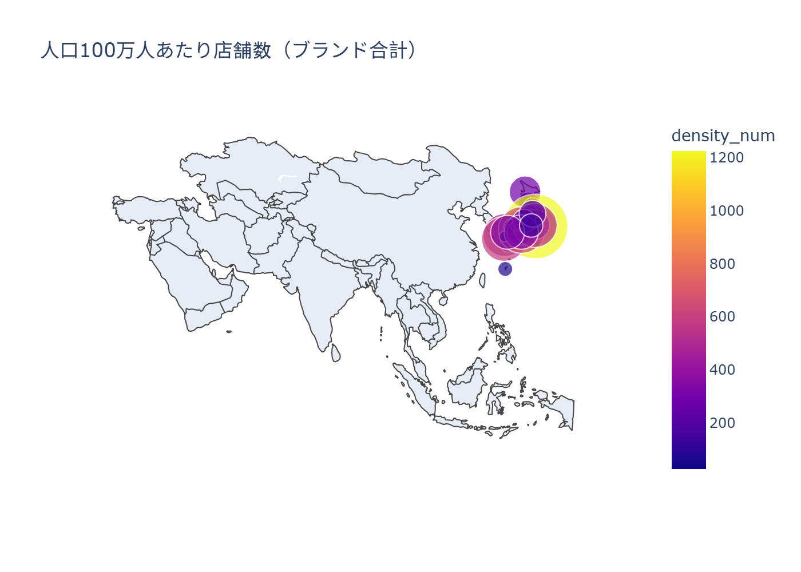

# 全国コンビニ市場分析（Portfolio / Python）

## 概要・コンセプト
このリポジトリは面接用ポートフォリオとして作成したものです。
日本全国主要コンビニチェーンの店舗分布・市場構造・売上推移を、戦略的視点とデータ分析技術の両面から総合的に可視化・提案しています。

「単なるデータ解析」ではなく、経営意思決定に直結する実務的な洞察／戦略提案まで一貫して示すことを重視しています。

## 概要（Overview）
- テーマ：全国コンビニ市場の地域別店舗数・売上推移・上位ブランドのシェア分析  
- 使用言語：Python（pandas, matplotlib, seaborn, numpy, plotly）
- 開発環境：Jupyter Notebook
- リポジトリ構成：`notebooks/`（Notebook）, `figs/`（図表）, `data/`（公開可能な小規模データ）

## 背景・目的（Background / Objective）
- 背景：コンビニ市場は大都市圏に集中しやすい一方、地域特性によりブランド構成や販売動向が異なる可能性がある。  
- 目的：地域×時系列での店舗数・売上の特徴を可視化し、上位ブランドのシェアの変化と示唆を抽出する。

## データ（Data）
- 出所：経産省 商業動態統計オープンデータ（※本リポジトリのサンプルはAI生成のダミーデータを加工）  
- 期間：2023
- 粒度：月次／都道府県別 
- 前処理：欠損補完、カテゴリ正規化、単位統一など

## 成果物イメージ（Outputs）
- 上位3ブランドのシェア（2023年）  
  

- 都市別競争状況（Top 5都道府県）
  
  
- 月別売上推移分析（ブランド別季節傾向）
  

- 都道府県別店舗数ヒートマップ  
  

## 主要な知見（Key Findings）
- 東京都・大阪府・神奈川県など都市圏で売上・店舗数が高水準。
- セブン-イレブンは店舗数・売上ともに優位。
- 夏季（7–8月）にアイス・飲料の売上増により特定ブランドのシェア上昇が見られた。  
- 地域ごとの気候・イベントと売上傾向を掛け合わせたマイクロマーケティング戦略が有効。

## 分析ノートブック（Notebook）
- `notebooks/conbini_market_analysis.ipynb`  
  - 再現手順：`requirements.txt` を `pip install -r requirements.txt` で導入 → Notebook 実行

## 再現環境（Environment）
- Python 3.11 以上  
- 主要ライブラリ：pandas / numpy / matplotlib　/seaborn　/plotly / jupyter  
- インストール：
  ```bash
  pip install -r requirements.txt

## 免責（Disclaimer）
本リポジトリのデータはサンプル（AI生成）であり、実データとは異なる可能性があります。分析手順のデモ目的で公開しています。
